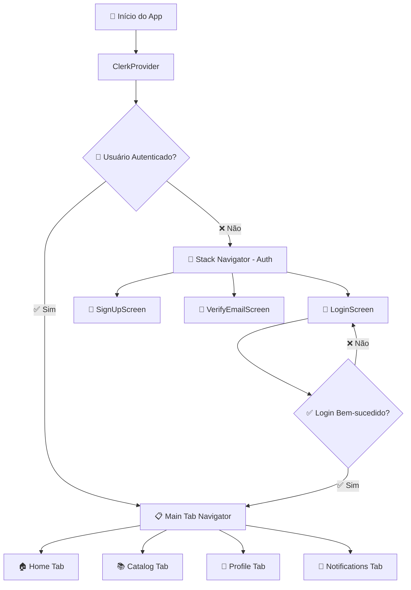
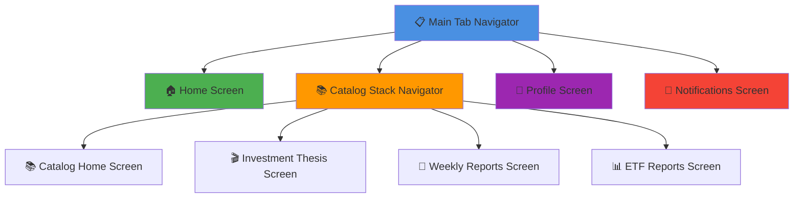
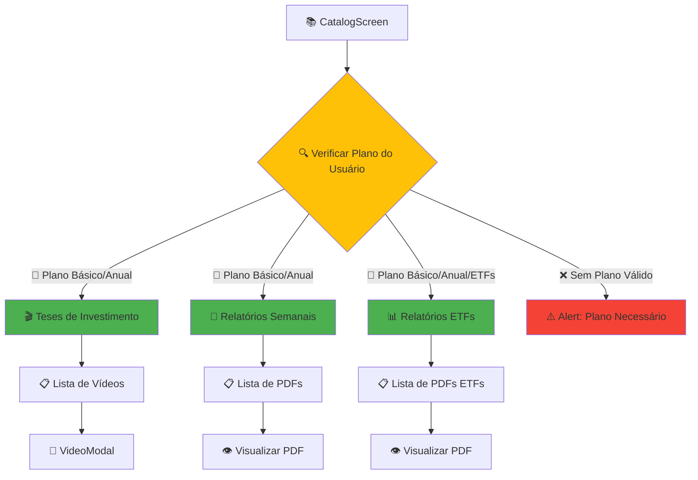
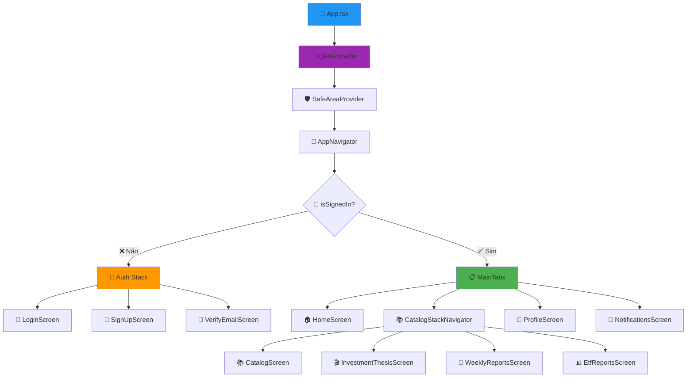
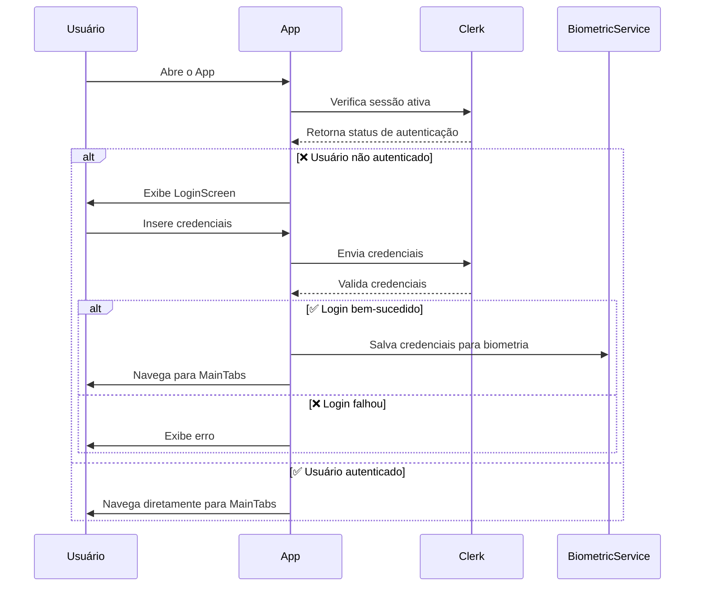
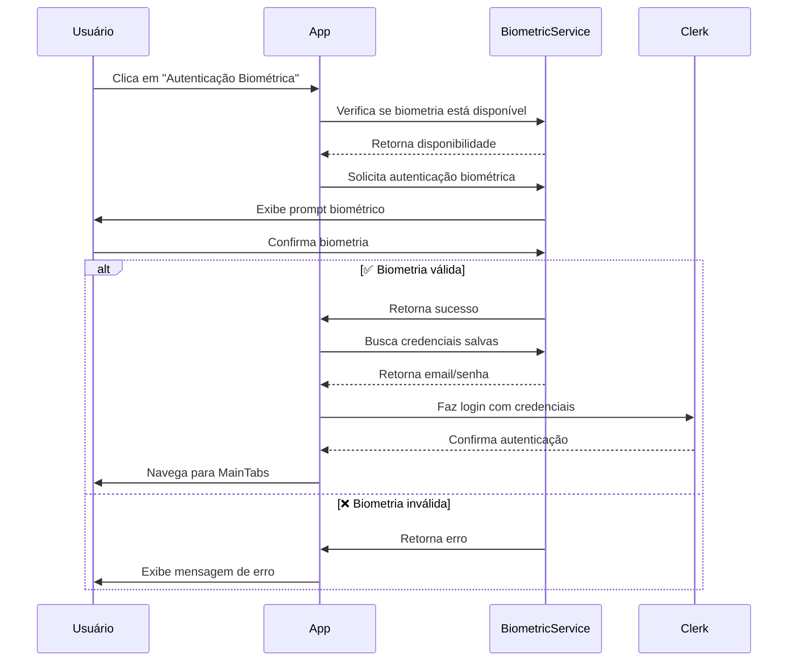
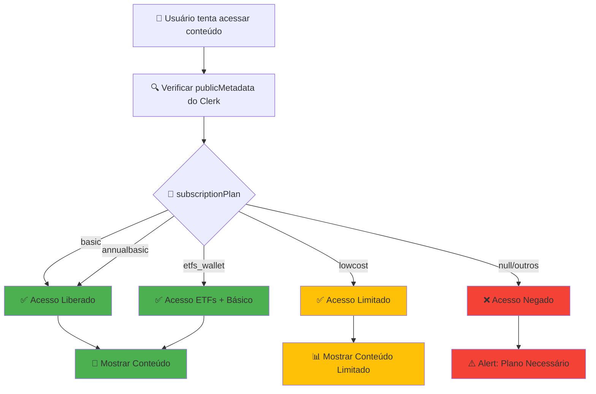
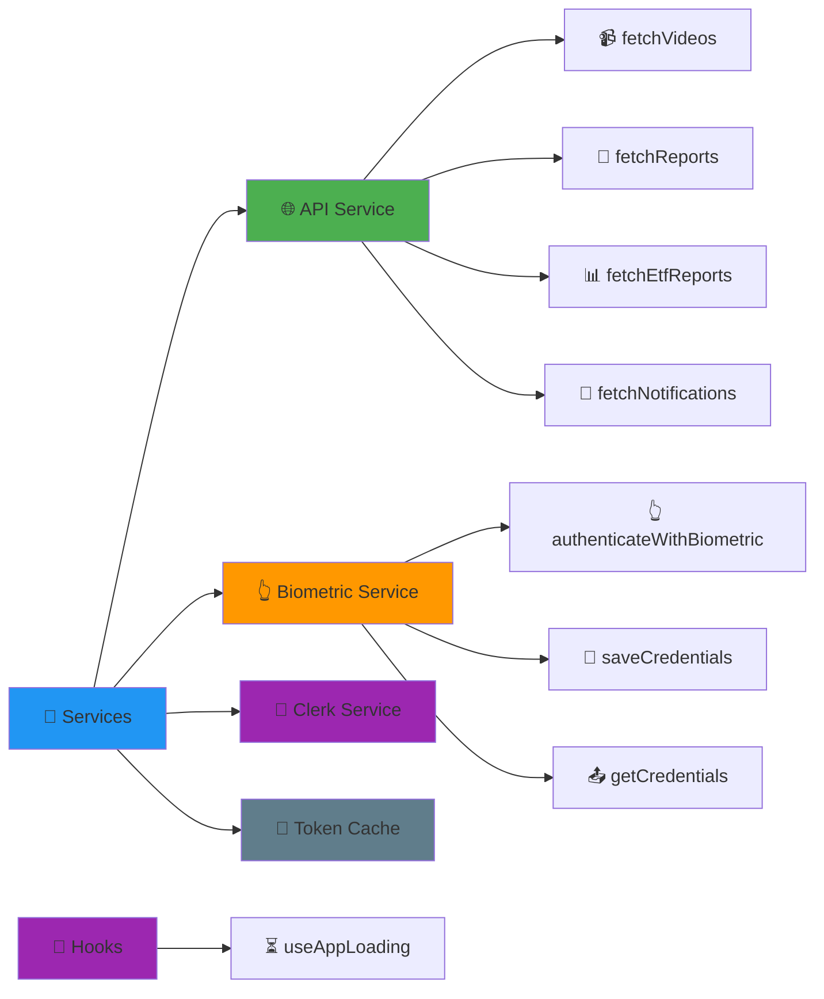

# Diagramas Mermaid - App Mobile LucasFiiResearch

## 1. Estrutura Geral do Aplicativo



## 2. Navegação Principal (Tab Navigator)



## 3. Fluxo do Catálogo e Verificação de Plano



## 4. Arquitetura de Componentes



## 5. Fluxo de Autenticação



## 6. Fluxo de Biometria



## 7. Estrutura de Dados e APIs

```mermaid
graph TD
    A[📱 App Mobile] --> B[🌐 API Service]
    B --> C[🔗 https://lucasfiiresearch.dev.br]
    
    B --> D[📹 fetchVideos<br/>/api/videos]
    B --> E[📄 fetchReports<br/>/api/reports/pdfs/]
    B --> F[📊 fetchEtfReports<br/>/api/etf-pdfs]
    B --> G[🔔 fetchNotifications<br/>/api/notifications]
    
    D --> H[🎬 HomeVideo[]]
    E --> I[📄 Report[]]
    F --> J[📊 EtfReport[]]
    G --> K[🔔 Notification[]]
    
    style A fill:#2196F3
    style B fill:#4CAF50
    style C fill:#FF9800
```

## 8. Fluxo de Verificação de Plano



## 9. Serviços e Hooks



## 10. Estrutura de Arquivos

```mermaid
graph TD
    A[📁 src/] --> B[🧩 components/]
    A --> C[🎣 hooks/]
    A --> D[🧭 navigation/]
    A --> E[📱 screens/]
    A --> F[🔧 services/]
    A --> G[📝 types/]
    
    B --> B1[🔘 Button]
    B --> B2[📝 Input]
    B --> B3[⏳ LoadingScreen]
    B --> B4[🔑 GoogleSignInButton]
    
    E --> E1[📚 etf-reports/]
    E --> E2[🎬 investment-thesis/]
    E --> E3[🔔 notifications/]
    E --> E4[📄 weekly-reports/]
    E --> E5[🔑 LoginScreen]
    E --> E6[📝 SignUpScreen]
    E --> E7[🏠 HomeScreen]
    E --> E8[📚 CatalogScreen]
    E --> E9[👤 ProfileScreen]
    
    F --> F1[🌐 api.ts]
    F --> F2[👆 biometric.ts]
    F --> F3[🔐 clerk.ts]
    F --> F4[💾 tokenCache.ts]
    
    style A fill:#2196F3
    style B fill:#4CAF50
    style C fill:#9C27B0
    style D fill:#FF9800
    style E fill:#F44336
    style F fill:#607D8B
    style G fill:#795548
```



## Como Visualizar os Diagramas

Para visualizar estes diagramas Mermaid, você pode:

1. **GitHub**: Os diagramas serão renderizados automaticamente no GitHub
2. **VS Code**: Instale a extensão "Mermaid Preview"
3. **Online**: Use https://mermaid.live/
4. **Documentação**: Muitas ferramentas de documentação suportam Mermaid

## Tecnologias Utilizadas

- 🚀 **React Native** + **Expo**
- 📝 **TypeScript**
- 🧭 **React Navigation** (Stack + Tab Navigator)
- 🔐 **Clerk** (Autenticação)
- 👆 **Expo Local Authentication** (Biometria)
- 💾 **Expo Secure Store** (Armazenamento seguro)
- 🎨 **Ionicons** (Ícones)
- 🛡️ **Safe Area Context** (Área segura)

## Funcionalidades Principais

- ✅ **Autenticação** com Clerk (email/senha + biometria)
- 💎 **Controle de acesso** baseado em planos de assinatura
- 📚 **Catálogo de conteúdo** (vídeos, relatórios, ETFs)
- 🔔 **Sistema de notificações**
- 👤 **Perfil do usuário**
- 🌐 **Integração com API** do backend
- 📱 **Interface responsiva** e moderna
