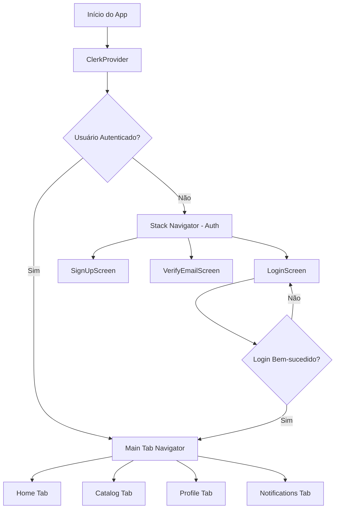
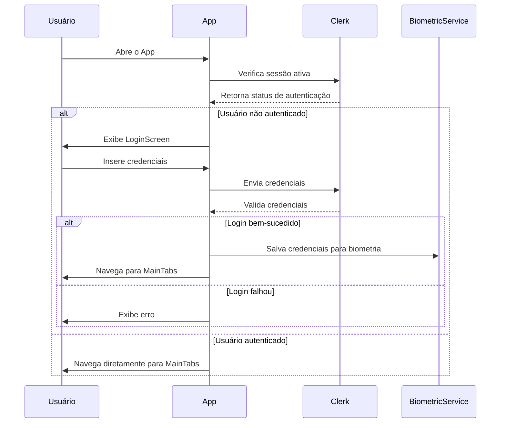
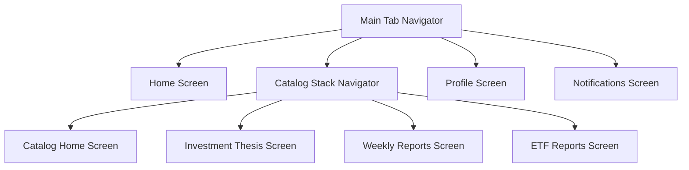
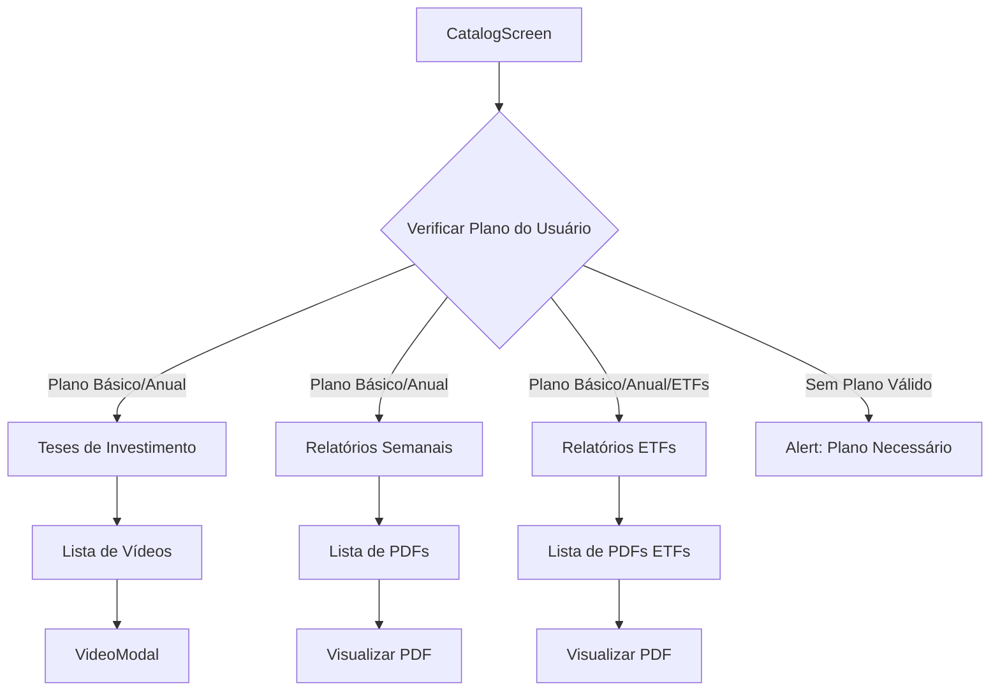
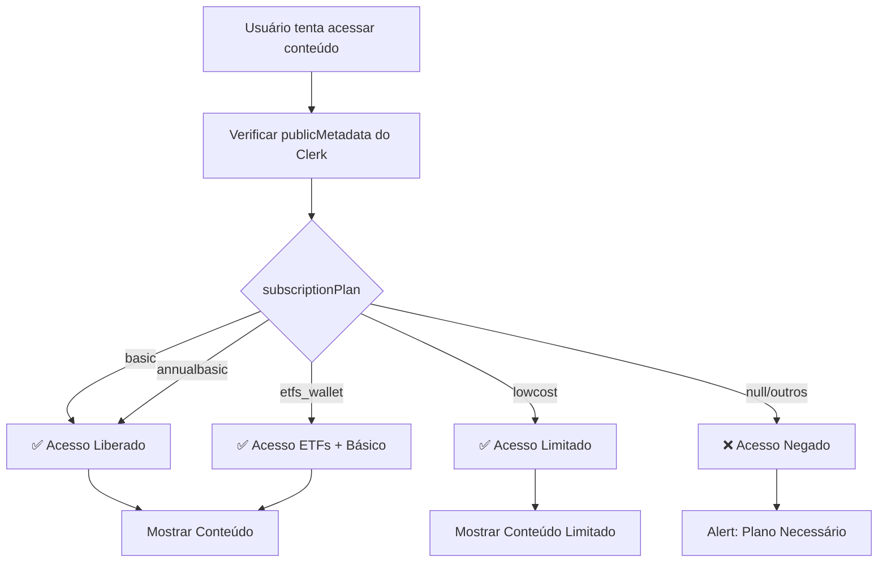
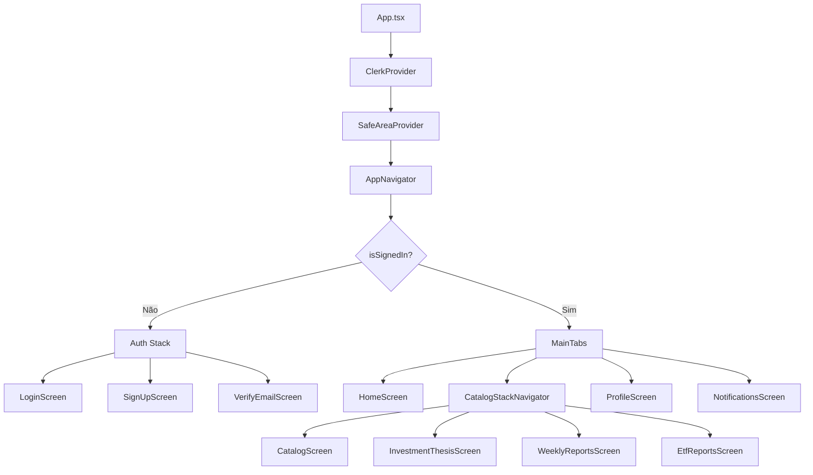
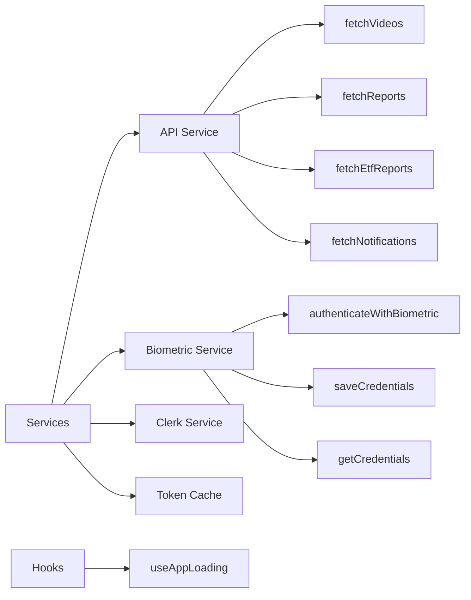
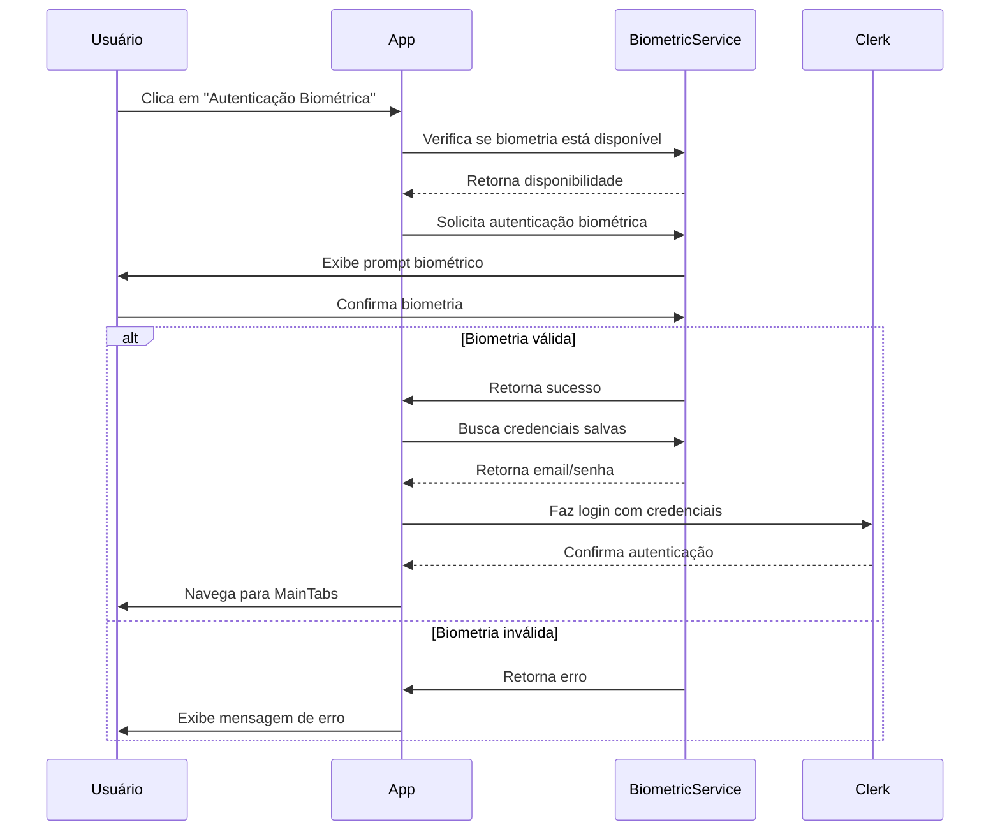

# Fluxograma do App Mobile LucasFiiResearch - Casa de Análises

## Estrutura Geral do Aplicativo



## Fluxo de Autenticação



## Navegação Principal (Tab Navigator)



## Fluxo do Catálogo



## Estrutura de Dados e APIs

```mermaid
graph TD
    A[App Mobile] --> B[API Service]
    B --> C[https://lucasfiiresearch.dev.br]
    
    B --> D[fetchVideos - /api/videos]
    B --> E[fetchReports - /api/reports/pdfs/]
    B --> F[fetchEtfReports - /api/etf-pdfs]
    B --> G[fetchNotifications - /api/notifications]
    
    D --> H[HomeVideo[]]
    E --> I[Report[]]
    F --> J[EtfReport[]]
    G --> K[Notification[]]
```

## Fluxo de Verificação de Plano



## Arquitetura de Componentes



## Serviços e Hooks



## Fluxo de Biometria



## Lista de Telas e Funcionalidades

### 📱 **Telas de Autenticação**
- **LoginScreen**: Login com email/senha + biometria
- **SignUpScreen**: Cadastro de novos usuários
- **VerifyEmailScreen**: Verificação de email

### 🏠 **Telas Principais**
- **HomeScreen**: Dashboard com saudação e status do plano
- **CatalogScreen**: Menu principal de conteúdo
- **ProfileScreen**: Perfil do usuário
- **NotificationsScreen**: Notificações do usuário

### 📚 **Telas de Conteúdo**
- **InvestmentThesisScreen**: Lista de vídeos educativos
- **WeeklyReportsScreen**: Relatórios semanais em PDF
- **EtfReportsScreen**: Relatórios de ETFs em PDF

### 🎬 **Componentes de Mídia**
- **VideoModal**: Player de vídeos
- **VideoCard**: Card de vídeo individual
- **ReportCard**: Card de relatório PDF
- **EtfReportCard**: Card de relatório ETF

### 🔔 **Componentes de Notificação**
- **NotificationCard**: Card de notificação individual

### 🔧 **Serviços**
- **API Service**: Comunicação com backend
- **Biometric Service**: Autenticação biométrica
- **Clerk Service**: Gerenciamento de autenticação
- **Token Cache**: Cache de tokens de autenticação

### 🎨 **Componentes UI**
- **Button**: Botão customizado
- **Input**: Campo de entrada customizado
- **LoadingScreen**: Tela de carregamento
- **GoogleSignInButton**: Botão de login com Google

## Tecnologias Utilizadas

- **React Native** + **Expo**
- **TypeScript**
- **React Navigation** (Stack + Tab Navigator)
- **Clerk** (Autenticação)
- **Expo Local Authentication** (Biometria)
- **Expo Secure Store** (Armazenamento seguro)
- **Ionicons** (Ícones)
- **Safe Area Context** (Área segura)

## Estrutura de Arquivos

```
src/
├── components/          # Componentes reutilizáveis
├── hooks/              # Hooks customizados
├── navigation/         # Configuração de navegação
├── screens/           # Telas do aplicativo
│   ├── etf-reports/
│   ├── investment-thesis/
│   ├── notifications/
│   └── weekly-reports/
├── services/          # Serviços (API, Biometria, etc.)
└── types/             # Definições de tipos TypeScript
```

Este fluxograma representa a arquitetura completa do aplicativo mobile LucasFiiResearch, mostrando desde a autenticação até o acesso ao conteúdo baseado no plano de assinatura do usuário.
